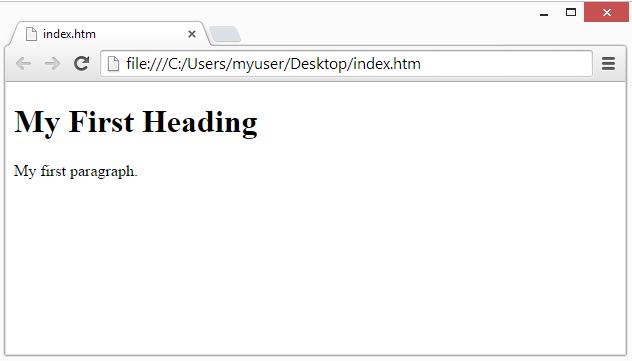

# Htmlga Kirish 

HTML veb-sahifalar uchun standart belgilash tilidir.

HTML yordamida siz o'z veb-saytingizni yaratishingiz mumkin. 

HTMLni o'rganish juda oson - bu sizga yoqadi!

## HTML nima?

- HTML Hyper Text Markup Language degan ma'noni anglatadi
- HTML veb-sahifalarni yaratish uchun standart belgilash tilidir
- HTML Web-sahifaning tuzilishini tavsiflaydi
- HTML bir qator elementlardan iborat
- HTML elementlari brauzerga kontentni qanday ko'rsatishni aytadi
- HTML elementlari "bu sarlavha", "bu paragraf", "bu havola" va boshqalar kabi kontent qismlarini belgilaydi.

## Oddiy HTML hujjati
```html
<!DOCTYPE html>
    <html>
        <head>
            <title>Sahifa sarlavhasi</title>
        </head>
        <body>
            <h1>Mening birinchi sarlavham</h1>
            <p>Mening birinchi matnim</p>
        </body>
    </html>
```

## Tepadagi Misol tushuntiriladi
- `<!DOCTYPE html>` deklaratsiyasi ushbu hujjat HTML5 hujjati ekanligini belgilaydi
- `<html>` elementi HTML sahifasining ildiz elementidir
- `<head>` elementi HTML sahifasi haqidagi meta-ma'lumotni o'z ichiga oladi
- `<title>` elementi HTML sahifasi uchun sarlavhani belgilaydi (bu brauzerning sarlavha satrida yoki sahifa yorlig'ida ko'rsatilgan)
- `<body>` elementi hujjatning tanasini belgilaydi va sarlavhalar, paragraflar, rasmlar, giperhavolalar, jadvallar, ro'yxatlar va boshqalar kabi barcha ko'rinadigan tarkiblarni oz ichiga oladi
- `<h1>` elementi katta sarlavhaligini belgilaydi
- `<p>` elementi matnligini belgilaydi

## HTML elementi nima?

HTML elementi boshlang'ich teg, ba'zi kontent va tugatish tegi bilan belgilanadi:
- `<tegninomi>` Kontent shu yerda... `</tegninomi>`

HTML elementi boshlang'ich tegdan tortib to tugatish tegigacha bo'lgan hamma narsadir:

- `<h1>` Mening birinchi sarlavham `</h1>` 
- `<p>` Mening birinchi xatboshim. `</p>`

Eslatma: Ba'zi HTML elementlarida tarkib yo'q (masalan, <br> elementi). Bu elementlar bo'sh elementlar deb ataladi. Bo'sh elementlarda yakuniy teg yo'q!


- Eslatma: Ba'zi HTML elementlarida tarkib yo'q (masalan, <br> elementi). Bu elementlar bo'sh elementlar deb ataladi. Bo'sh elementlarda yakuniy teg yo'q!

## Veb-brauzerlar

Veb-brauzerning (Chrome, Edge, Firefox, Safari) maqsadi HTML hujjatlarini o'qish va ularni to'g'ri ko'rsatishdir.

Brauzer HTML teglarini ko'rsatmaydi, lekin hujjatni qanday ko'rsatishni aniqlash uchun ulardan foydalanadi:



## HTML sahifa tuzilishi

Quyida HTML-sahifa tuzilishining strukturasi keltirilgan:


- Eslatma: `<body>` bo'limi ichidagi kontent brauzerda ko'rsatiladi. `<title>` elementi ichidagi tarkib brauzerning sarlavha satrida yoki sahifa yorlig'ida ko'rsatiladi.

- Ushbu qo'llanma eng so'nggi HTML5 standartiga amal qiladi.

---

Keyingi Bo'lim 👇

- [Matn taglari](/Topics/Html/matn)
